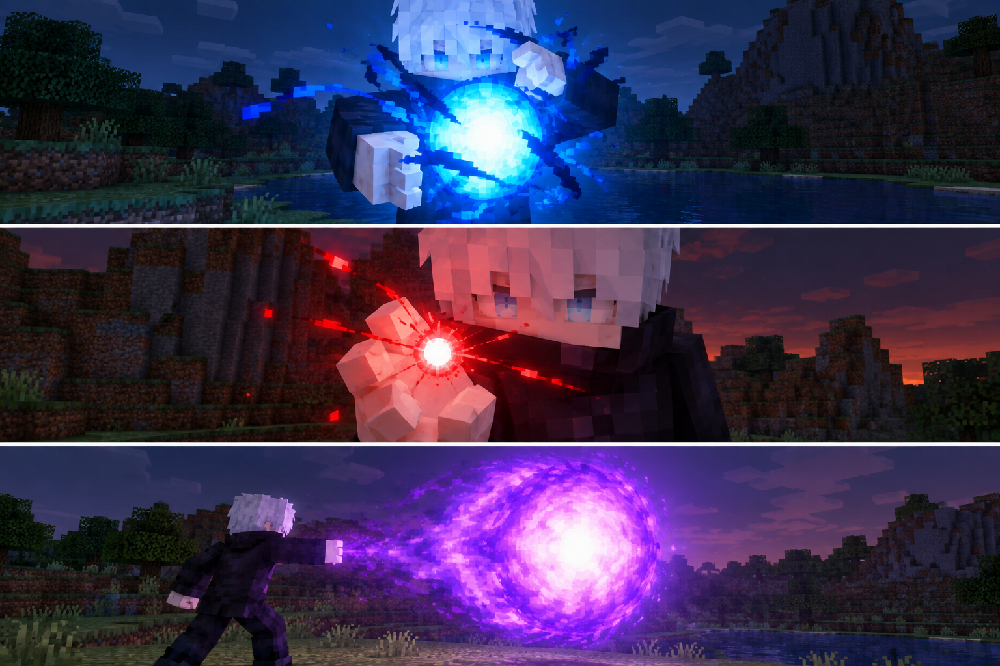

# Cursed Oath · 咒誓

A **Minecraft 26.3 Fabric combat mod** inspired by _Jujutsu Kaisen_, with destructive techniques and domain battles in Minecraft's block-based world.

**Development prototype:** abilities are available through practice commands; survival progression is not implemented. Supports English, Simplified Chinese, and Japanese.



_AI-generated art reference, not an in-game screenshot. Character details and lighting are illustrative._

## Abilities

- **Limitless:** Infinity defense, Blue's attraction, Red's repulsion, and Hollow Purple's fusion and piercing flight.
- **Shrine:** ranged Dismantle, contact Cleave, and Malevolent Shrine's sustained sure hits and terrain destruction.
- **Unlimited Void:** a breakable closed barrier and information overload that immobilizes and deals lethal damage to unprotected ordinary targets.
- **Shared abilities:** reinforced melee with a chance of Black Flash, self-healing, Simple Domain, and Domain Amplification.

Overlapping domains suppress sure hits in their shared area. Unlimited Void hides the terrain behind a panorama while retaining the original world's blocks and collisions. See [scope and limitations](docs/design.zh-CN.md#当前交付边界).

**Use a disposable world: terrain destruction is permanent.** Blocks with block entities, fluid-containing blocks, unbreakable blocks, and blocks denied by protection checks are preserved. They do not shield targets from Purple. Protection-mod compatibility needs separate verification.

## Try it

Install **JDK 25** and run from the repository root:

```sh
./gradlew runClient
```

Use `gradlew.bat` on Windows. The wrapper resolves development dependencies. In a world with commands enabled, run:

```text
/cursedoath practice
```

This unlocks all prototype abilities and resets resources and the Shrine radius. These player commands require operator permissions:

| Command                       | Effect                                                |
| ----------------------------- | ----------------------------------------------------- |
| `/cursedoath practice`        | Unlock abilities and reset practice state             |
| `/cursedoath clear`           | Disable practice access                               |
| `/cursedoath radius <blocks>` | Set the next Shrine radius: 16–200 blocks, default 96 |

## Controls

| Default key | Action                                                                |
| ----------- | --------------------------------------------------------------------- |
| B           | Open or close the technique wheel                                     |
| R           | Select the next technique                                             |
| V           | Use the selected technique; toggle sustained abilities                |
| X           | Cancel preparation, melee readiness, defenses, and your active domain |
| G           | Prepare one reinforced melee strike                                   |

The wheel keeps the world running. Point or use Tab to preview; left-click or Enter selects, while right-click or the cast key uses the technique. Selection closes the wheel; Escape closes it without changing the selection. Keys can be rebound in Minecraft Options.

After G, attack within three seconds with over 90% attack strength for a 20% Black Flash chance; an attack or empty swing consumes readiness. X does not recall released projectiles. “Hide Lightning Flashes” reduces Shrine's decorative slashes. Domain sounds have localized subtitles. See the [combat guide](docs/combat.zh-CN.md) for costs, damage, defenses, and burnout.

## Build and install

```sh
./gradlew build
```

Install the runtime JAR from `build/libs/` on client and server with **Fabric Loader, Fabric API, and Player Animation Library** compatible with Minecraft 26.3. Dependencies are not bundled; do not install the `-sources.jar`. See [dependency declarations](build.gradle.kts) and [runtime requirements](src/main/resources/fabric.mod.json). `./gradlew runServer` launches a development server.

## Contribute

Follow [Repository Guidelines](AGENTS.md) for layout, formatting, and verification. Reports are in `build/reports/`; client captures are in `build/run/clientGameTest/screenshots/`. Model changes also require the [export checks](art/shrine/README.md#export-and-verify).

Bug reports should include reproduction steps, expected behavior, and relevant logs. PRs should explain changes and checks performed, with screenshots for visible changes. Device compatibility, visual quality, and multiplayer load need separate verification.

## Documentation

The detailed guides are in Chinese and contain **full-series manga spoilers**.

- [Design](docs/design.zh-CN.md): goals, delivered scope, and future work.
- [Combat](docs/combat.zh-CN.md): implemented rules and tuning.
- [Architecture](docs/architecture.zh-CN.md): ownership, lifecycle, rendering, and testing.
- [Presentation](docs/presentation.zh-CN.md): visual language and performance acceptance.
- [Localization](docs/localization.zh-CN.md): terminology and translation conventions.
- [Sources](docs/sources.zh-CN.md): adaptation evidence and unresolved questions.

## License

[MPL-2.0](LICENSE).
